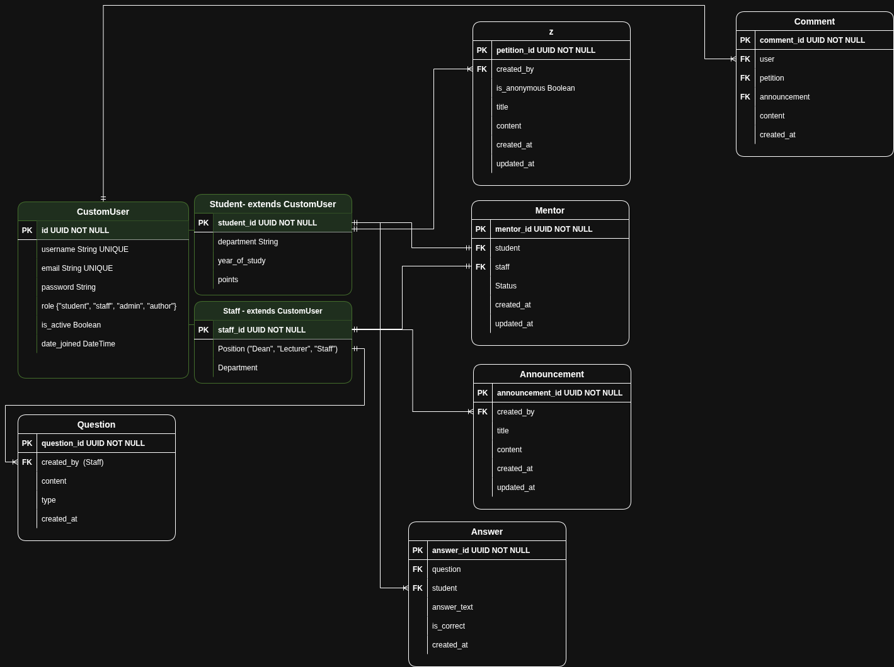

# 🌐 HUlink – Hawassa University Digital Connection Platform

HUlink (Hawassa University Link) is a web-based communication and management platform built to strengthen the relationship between **students**, **staff**, and **mentors** within the university community.
It replaces manual workflows with a seamless digital experience for announcements, petitions, mentorship, discipline management, and academic engagement.

---

## 📖 Table of Contents

* [Overview](#-overview)
* [Features](#-features)
* [Architecture](#-architecture)
* [Tech Stack](#-tech-stack)
* [Installation & Setup](#-installation--setup)
* [API Endpoints](#-api-endpoints)
* [Authentication Flow](#-authentication-flow)
* [Project Structure](#-project-structure)
* [Roadmap](#-roadmap)
* [Author](#-author)

---

## 🧩 Overview

**HUlink** was created to:

* Bridge communication gaps between **students** and **university staff**
* Encourage mentorship and academic support
* Provide a digital space for **announcements**, **petitions**, **comments**, and **discipline reports**
* Reduce paperwork and enable accountability in all university activities

The system follows a modular Django architecture with **role-based access control** and **JWT authentication**.

---

## ✨ Features (Current Stage)

| Category             | Description                                                            |
| -------------------- | ---------------------------------------------------------------------- |
| **User Management**  | Custom `User` model with roles (`student`, `staff`, `mentor`, `admin`) |
| **Authentication**   | Secure login, registration, and logout using JWT tokens                |
| **Profiles**         | Separate models for `Student`, `Staff`, and `Mentor`                   |
| **Mentorship**       | Link staff with students for academic guidance                         |
| **Community**        | Students and staff can create petitions, announcements, and comments   |
| **Discipline**       | Students can submit reports; staff can review and update status        |
| **API-Ready**        | RESTful endpoints built using Django REST Framework                    |
| **Role-Based Views** | Different access privileges depending on user type                     |

---

## 🏗️ Architecture

**App Structure**

* `accounts/` → User registration, authentication, and profiles
* `community/` → Announcements, Comments, and Petitions
* `discipline/` → Discipline reports and follow-ups

## 🗄️ Database Schema



**Database Models**

| Model                | Description                                                     |
| -------------------- | --------------------------------------------------------------- |
| **CustomUser**       | Extends Django’s `AbstractUser`; adds a `role` field            |
| **Student**          | One-to-one with `CustomUser`; includes year, department, points |
| **Staff**            | One-to-one with `CustomUser`; stores staff position             |
| **Mentor**           | Connects `Staff` and `Student` models                           |
| **Announcement**     | Created by staff to inform students                             |
| **Comment**          | Users comment on announcements or petitions                     |
| **Petition**         | Students submit issues anonymously or publicly                  |
| **DisciplineReport** | Reports submitted by students and managed by staff              |

---

## 🧠 Tech Stack

| Layer                | Technology                                            |
| -------------------- | ----------------------------------------------------- |
| **Backend**          | Django REST Framework                                 |
| **Authentication**   | JWT (`djangorestframework-simplejwt`)                 |
| **Database**         | SQLite (development), PostgreSQL (production planned) |
| **Frontend**         | React.js *(planned)*                                  |
| **Containerization** | Docker *(planned)*                                    |
| **Version Control**  | Git + GitHub                                          |

---

## ⚙️ Installation & Setup

### 1️⃣ Clone the Repository

```bash
git clone https://github.com/Orel-y/HUlink.git
cd HUlink
```

### 2️⃣ Create a Virtual Environment

```bash
python -m venv venv
source venv/bin/activate   # Linux/macOS
venv\Scripts\activate      # Windows
```

### 3️⃣ Install Dependencies

```bash
pip install -r requirements.txt
```

### 4️⃣ Apply Migrations

```bash
python manage.py makemigrations
python manage.py migrate
```

### 5️⃣ Create a Superuser

```bash
python manage.py createsuperuser
```

### 6️⃣ Run the Development Server

```bash
python manage.py runserver
```

Now open **[http://127.0.0.1:8000/](http://127.0.0.1:8000/)** to access HUlink.

---

## 🔑 API Endpoints

### 👤 Authentication

| Method   | Endpoint                  | Description                 |
| -------- | ------------------------- | --------------------------- |
| **POST** | `/api/accounts/register/` | Register new user           |
| **POST** | `/api/accounts/login/`    | Login and receive JWT token |
| **POST** | `/api/accounts/logout/`   | Logout and blacklist token  |

### 🧑‍🎓 Students

| Method  | Endpoint                       | Description         |
| ------- | ------------------------------ | ------------------- |
| **GET** | `/api/accounts/students/`      | List all students   |
| **GET** | `/api/accounts/students/<id>/` | Get student details |

### 🧑‍🏫 Staff

| Method  | Endpoint                    | Description       |
| ------- | --------------------------- | ----------------- |
| **GET** | `/api/accounts/staff/`      | List all staff    |
| **GET** | `/api/accounts/staff/<id>/` | Get staff details |

### 🤝 Mentorship

| Method  | Endpoint                      | Description          |
| ------- | ----------------------------- | -------------------- |
| **GET** | `/api/accounts/mentors/`      | List all mentorships |
| **GET** | `/api/accounts/mentors/<id>/` | Mentor detail view   |

### 📢 Community

| Method   | Endpoint                        | Description                             |
| -------- | ------------------------------- | --------------------------------------- |
| **POST** | `/api/community/petitions/`     | Create petition                         |
| **GET**  | `/api/community/petitions/`     | List petitions                          |
| **POST** | `/api/community/announcements/` | Create announcement                     |
| **GET**  | `/api/community/announcements/` | List announcements                      |
| **POST** | `/api/community/comments/`      | Add comment to petition or announcement |
| **GET**  | `/api/community/comments/`      | List comments                           |

### 📝 Discipline Management

| Method   | Endpoint                               | Description                        |
| -------- | -------------------------------------- | ---------------------------------- |
| **POST** | `/api/discipline/reports/`             | Submit discipline report (student) |
| **GET**  | `/api/discipline/reports/all/`         | List all reports (staff)           |
| **PUT**  | `/api/discipline/reports/<id>/status/` | Update report status (staff)       |

---

## 🔒 Authentication Flow

1. **Register** → User chooses a role (student, staff, or mentor). Profile is created automatically.
2. **Login** → Receive `access` and `refresh` JWT tokens.
3. **Access Protected Routes** → Add header:

```http
Authorization: Bearer <access_token>
```

4. **Logout** → Send `refresh` token to `/logout/` endpoint to blacklist it.

---

## 📂 Project Structure

```
hulink/
├── accounts/
│   ├── models.py
│   ├── views.py
│   ├── serializers.py
│   ├── urls.py
│   └── permissions.py
├── community/
│   ├── models.py
│   ├── views.py
│   ├── serializers.py
│   └── urls.py
├── discipline/
│   ├── models.py
│   ├── views.py
│   ├── serializers.py
│   └── urls.py
├── hulink/
│   ├── settings.py
│   ├── urls.py
│   └── wsgi.py
├── manage.py
└── README.md
```

---

## 🧭 Roadmap (Next Steps)

| Feature                   | Description                          | Status              |
| ------------------------- | ------------------------------------ | ------------------- |
| **Announcements**         | Staff post updates, events, and info | 🟢 Implemented      |
| **Comments**              | Users comment on posts               | 🟢 Implemented      |
| **Petitions**             | Students submit issues or requests   | 🟢 Implemented      |
| **Discipline Management** | Report & track student behavior      | ⚪ Planned / partial |
| **Frontend (React)**      | User-friendly UI                     | ⚪ Planned           |
| **Dockerization**         | Deployment setup                     | ⚪ Planned           |

---

## 👨‍💻 Author

**Yoseph Wondimu**
🎓 Computer Science Student, Hawassa University
💡 Aspiring System Architect | Backend Developer
📬 *Building HUlink to bridge students and staff through technology.*

